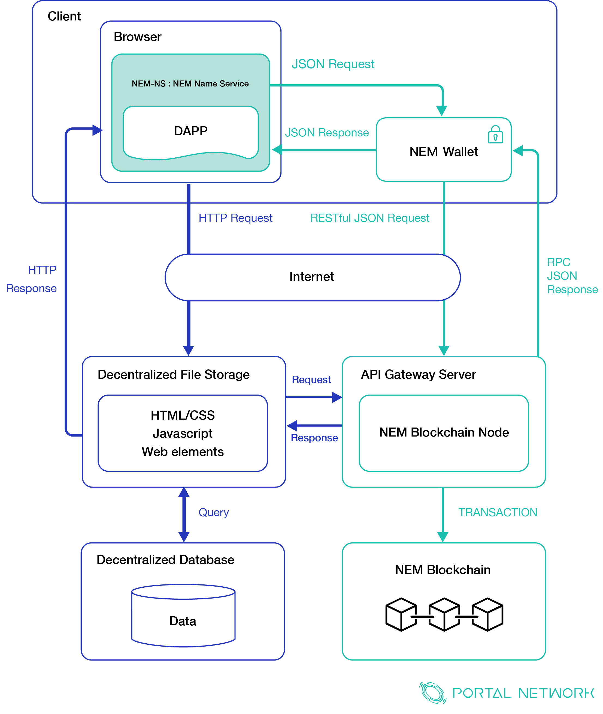
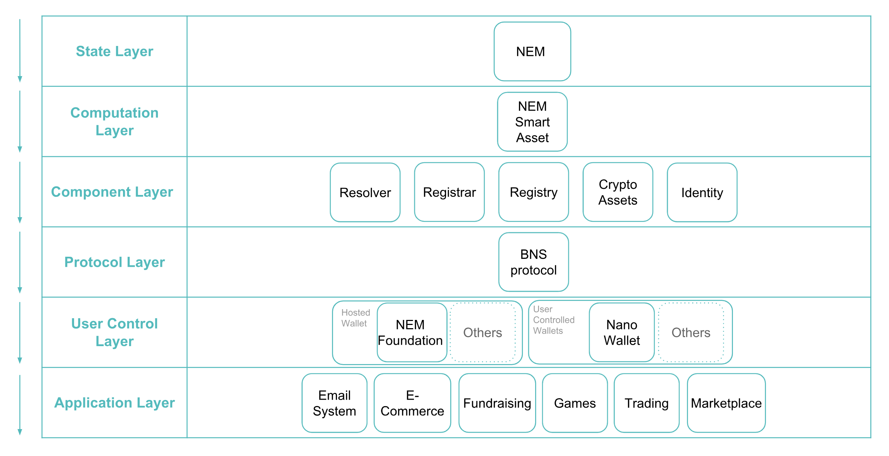
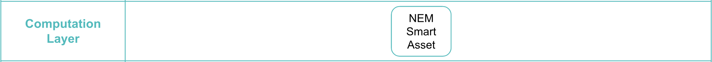

> 📖🔍 Documents of the NEM Name Service.

# Overview

## 💡 What is NEM?
NEM is the world’s first "Smart Asset" blockchain. Built with businesses in mind, NEM is a world class platform designed to offer a streamlined method to maintain a secure ledger of transactions.

NEM’s blockchain technology offers the potential to drastically simplify an enormous variety of secure ledger and transaction tracking systems. It provides an adaptable API interface that can be used with any programming language.

Designed with modular customization in mind, NEM can be used for almost any application thanks to its "Smart Asset System". 

## 💡 What is BNS?
BNS – or blockchain name system – is the protocol on the internet that turns human-comprehensible decentralized website names such as ‘website.xem’ or ‘mywebsite.xem’ into addresses understandable by decentralized network machines.

## 📝 Description

NNS is the NEM Name Service, a distributed, open, and extensible naming system based on the NEM blockchain.

## 📚 Documents

#### Table of Contents
- [Introduction](./docs/INTRODUCTION.md)
- [Implementation](./docs/IMPLEMENTATION.md)
    - [Registry](./docs/REGISTRY.md)
    - [Registrar](./docs/REGISTRAR.md)
    - [Resolver](./docs/RESOLVER.md)
- [Integration](./docs/INTEGRATION.md)
    - [Docker Setup](./docs/NEM_DEV_DOCKER.md)

## NEM in Web3.0
NEM Name Service plays an connecting and entry layer in Web3.0 services. It connects with NEM wallet, blockchain server, decentralized content resources, and decentralized database. 


## NEM Technical Stack
NEM Name Service (NEM-NS) is governed by three smart assets components, registrar, registry, and resolver. The three smart assets contain the core logic for the NEM Name Service implementation, from the ownership managment for a domain, to the global resolving layer that is reposible for connecting different tech stacks and enhances the usability for different infrastructures. These layers structure starts from top to botto along the y-axis, and will be explained in the following sections.


### State Layer
State layer is where user’s “state”, or user’s information and behavior, is stored. NEM is where these data are stored, and gives users the ability to control their own state. And from hereon every layer is built on or is compatible with the layers below it.


### Computation Layer
NEM uses its smart asset in its computation layer, which is responsible for executing complicated calculations. And by giving users direct API access to a specialized set of tested and secure on-blockchain features, Portal Network will be deploying NEM-NS (Smart Asset Standard) on this layer that consists 3 major components. 


### Component Layer
The component layer can provide more functions to the smart assets by combing the State Layer and Computation Layer (ie. crypto assets, identity, cryptocurrency). In the case of NEM-NS, we will consist three abstract components which are `registrar`, `registry`, and `resolver` in order to modularize the whole NEM Name service into three pieces. These three main smart contracts components represent the three responsibilities for the best practice of the current naming system.

The `registry` stores a list of every domain (and subdomain, and sub-sub-domain, and so forth) and the related ownership information. The `registrar` governs the registering process for the specific domain. The mechanism design for the process should consider how to prevent the collusion and economical efficiency. The `resolver` is in charge of resolving the universal mapping logic from wallet address, contract address, decentralized content address, and many more.


### Protocol Layer
NEM Name Service can utilize the BNS protocol to modularize the business logic and provide the well-designed interfaces to let other services easily integrated with. It is a gateway for developers to connect different layers and increase more business capacity, enhance the usability and reduce the complexity.


### User Control Layer
User control layer is in charge of managing private keys to communicate with the state layer. NEM-NS empowers users to control, set up and manage their digital asset with an easier and readable text, which could be further utilized in the next application layer. 


### Application Layer
The above components provided by different layers unleashes more real business opportunities. For example, wallet that can resolve NEM-NS, dApp that utilize NEM-NS for users identity and more. All of these allow users to view and access the decentralized resources through simple names like `identity.nem`.


# Introduction

## NEM NIS Docker node setup

### NIS - NEM Infrastructure Server
The NEM Infrastructure Server (short: NIS) was written in Java. It allows you interact with NEM.

### Get start
For rapid development, NEM officialy offers a helper script file to automatically deploy docker container. If you insist on setup docker manually, here is [reference](https://blog.nem.io/nem-docker/). Below is tutorial of using helper script:

1. Download script first
```
mkdir nem-dev
cd nem-dev
curl -q https://raw.githubusercontent.com/rb2nem/nem-dev-guide/master/docker/ndev > ndev
chmod +x ndev
```

2. Execute script
```
$ ./ndev
```

The first time you run the script, it will:

- check if its `settings.sh` file exists, and create it if needed. The user is prompted for values to be provided.
- check if the required docker-compose.yml file is present, and download it from github if needed
- Download docker images from the DockerHub

To check that the containers are running:
```
$ ./ndev --status
```

It will print:
```
running containers are:
nem-dev_nemdevnis_1
nem-dev_nemdevtools_1
```

And open a shell in the NIS container: 
```
$ ./ndev -c nis bash
```
In container shell, check if NIS is running:
```
[root@23627cb63be0 /]# ps aux 
USER       PID %CPU %MEM    VSZ   RSS TTY      STAT START   TIME COMMAND
root         1  0.4  0.0  18240  3332 ?        Ss   13:09   0:00 bash
root        18  0.1  0.4  56200 15436 ?        Ss   13:09   0:00 /usr/bin/python /usr/bin/supervisord -c /etc/supervisord.conf
nem         23  305  8.3 3608648 320760 ?      Sl   13:09   0:15 java -Xms512M -Xmx1G -cp .:./*:../libs/* org.nem.deploy.CommonStarter
root        41  0.0  0.0  34424  2784 ?        R+   13:09   0:00 ps aux
```
This shows that NIS is running (this is the java -Xms512M -Xmx1G ... process).

If not, type below command:
```
[root@23627cb63be0 /]# supervisorctl start nis
```
You can access the logs of NIS with `tail /var/log/nis-stderr.log -f`:
```
[root@23627cb63be0 /]# tail /var/log/nis-stderr.log -f
2018-09-14 10:18:35.670 INFO synchronizing with Node [TBR2PTTGTINUOW5ENEXYWPIITRJ6XTVVZNYNUCMP <TBR2PTTGTINUOW5ENEXYWPIITRJ6XTVVZNYNUCMP>] @ [80.240.29.150] finished (org.nem.peer.services.NodeSynchronizer b)
2018-09-14 10:18:38.672 INFO synchronizing with Node [Hi, I am MedAlice2 <TALIC37AGCDGQIBK3Y2IPFHSRAJ4HLJPNJDTSTJ7>] @ [23.228.67.85] (org.nem.peer.services.NodeSynchronizer b)
2018-09-14 10:18:44.777 INFO received 400 blocks (12 transactions) in 4786 ms from remote (398833 ?s/tx) (org.nem.nis.sync.BlockChainUpdater c)
2018-09-14 10:18:44.908 INFO clustering completed: { clusters: 2 (average size: 10.50), hubs: 0, outliers: 523 } (org.nem.nis.pox.poi.PoiContext$AccountProcessor dh)
2018-09-14 10:18:44.910 INFO Iterations required: 6; converged?: true (org.nem.nis.cx.na.qcw run)
2018-09-14 10:18:44.911 INFO POI iterator needed 2ms. (org.nem.nis.pox.poi.PoiImportanceCalculator c)
2018-09-14 10:18:45.110 INFO validated 400 blocks (12 transactions) in 327 ms (27250 ?s/tx) (org.nem.nis.sync.BlockChainUpdateContext fz)
2018-09-14 10:18:45.111 INFO new block's score: 11226358709252895 (org.nem.nis.sync.BlockChainUpdateContext a)
2018-09-14 10:18:45.611 INFO chain update of 400 blocks (12 transactions) needed 499 ms (41583 ?s/tx) (org.nem.nis.sync.BlockChainUpdateContext fz)
2018-09-14 10:18:45.619 INFO synchronizing with Node [Hi, I am MedAlice2 <TALIC37AGCDGQIBK3Y2IPFHSRAJ4HLJPNJDTSTJ7>] @ [23.228.67.85] finished (org.nem.peer.services.NodeSynchronizer b)
2018-09-14 10:18:48.622 INFO synchronizing with Node [do-nem <TBQWT47B5GHLSGKX7CMKNPDAX2DA6MNQ7HZ3ATSI>] @ [178.62.61.222] (org.nem.peer.services.NodeSynchronizer b)
2018-09-14 10:18:51.583 INFO received 400 blocks (4 transactions) in 887 ms from remote (221750 ?s/tx) (org.nem.nis.sync.Blo
```

If you see that the NIS instance is communicating with other instances (synchronizing with Node [Hi, I am MedAlice2...) which means our NIS instance is synchronized ongoing. You can start to interact with NEM through [NEM-SDK](https://github.com/QuantumMechanics/NEM-sdk) now.

## 📣 Contributing
See [CONTRIBUTING.md](./CONTRIBUTING.md) for how to help out.

## 🗒 Licence
See [LICENSE](./LICENSE) for details.
