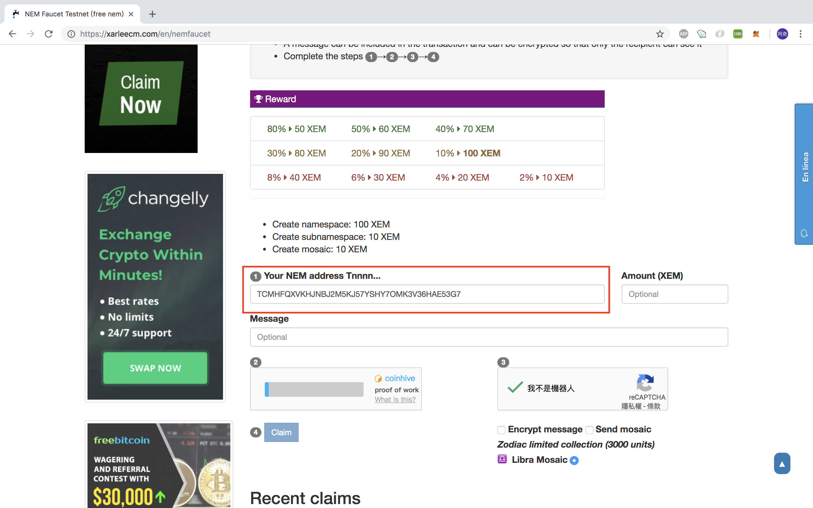
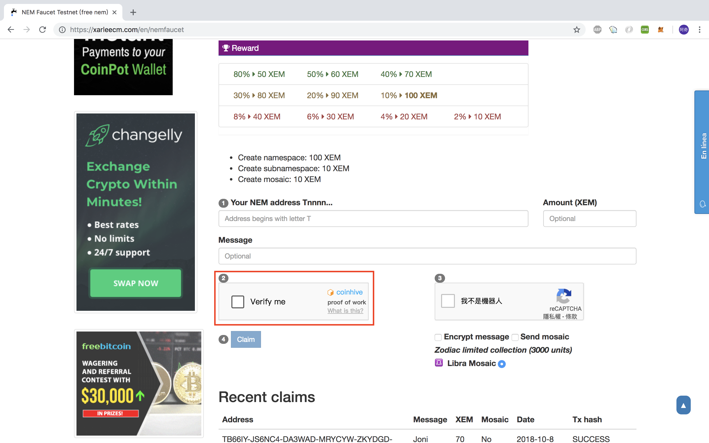
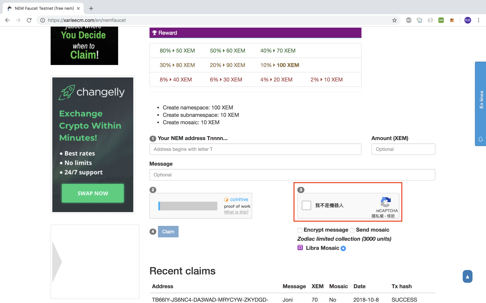
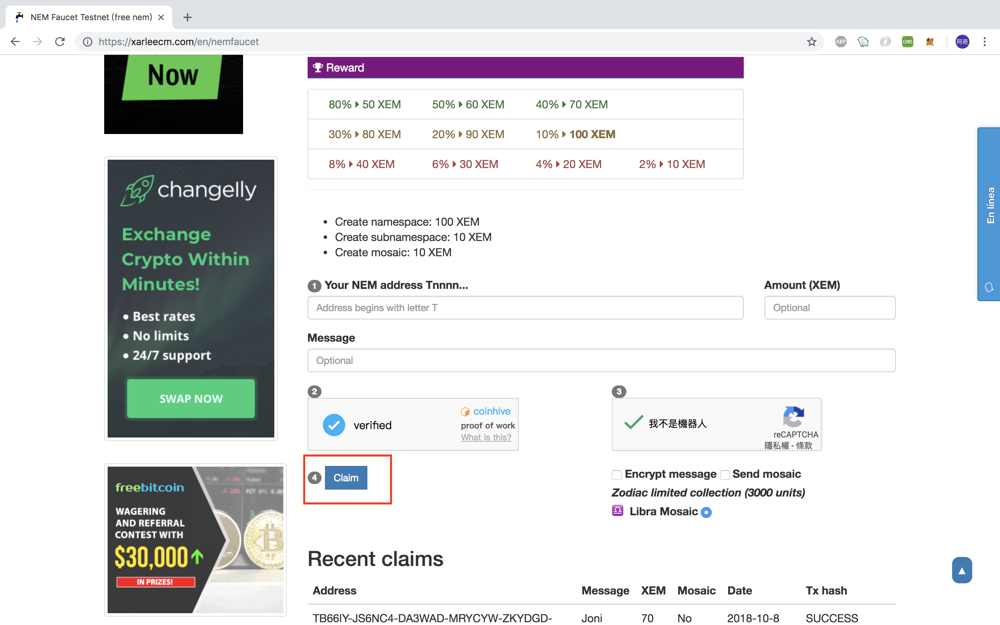

# How to request NEM testnet XEM

## XEM
"XEM" is NEM's currency code. It is similar to USD, EUR, CNY, JPY etc.

## Request XEM on testnet

1. Create a NEM testnet wallet ([tutorial](https://docs.nem.io/ja/nanowallet/creating-a-wallet))

2. There are 2 places you can ask for testnet token:
- Access [NEM testnet faucet](http://test-nem-faucet.44uk.net/) (you can only require 20 XEM here):
  
  Paste your wallet address:
    

- Access [NEM Faucet Testnet (free nem)](https://xarleecm.com/en/nemfaucet) (You can require many XEM here, the only restriction is one request per hour):

    First paste your address:
    

    Click verification button:
    
    

    Lastly, click the claim button:
    

    It allows you to randomly receive 10~100 XEM one time.

